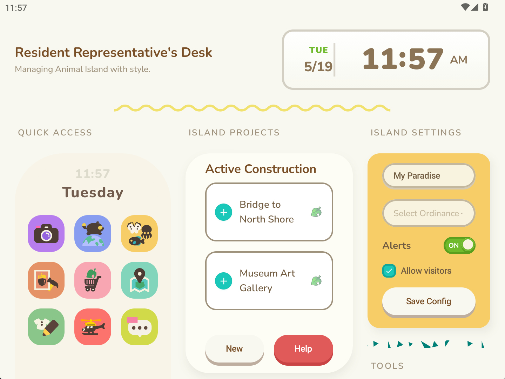

# 🏝 Animal-Island-UI

<div align="center">
        
</div>

<div align="center">
一款参考《动物森友会》风格的 Android Jetpack Compose 组件库
</div>

<br/>

<div align="center">
    <a href="https://github.com/liuyuhong0324/animal-island-ui/stargazers"></a>
    <a href="LICENSE"></a>
    <a href="https://github.com/liuyuhong0324/animal-island-ui/releases"></a>
</div>

<br/>

<p align="center">
    简体中文 | <a href="docs/README.en.md">English</a>
</p>

---

## 介绍

**Animal Island UI** 是一个轻量级的 Android Jetpack Compose 组件库。设计风格灵感来源于任天堂《集合啦！动物森友会》游戏界面，包含 Button、Card、Modal、Input 等常用 UI 组件，配套完整的设计系统与主题系统。

所有视觉元素、布局、图标、动画均为独立设计实现，未直接使用任何任天堂官方美术素材、代码或资源文件。

> 💡 **特别感谢** [@guokaigdg](https://github.com/guokaigdg) 的原始项目 [animal-island-ui](https://github.com/guokaigdg/animal-island-ui)，本项目是其 Android 版本的实现。

### 技术特性

- 🎨 **完整设计系统** - 色彩、字体、间距、圆角的系统化定义
- 🚀 **Jetpack Compose** - 基于最新的 Android 声明式 UI 框架
- 📦 **轻量库设计** - 模块化组件，易于集成使用  

## 预览

|                              |
|------------------------------|
|  |

## 快速开始

### 环境要求

| 项目 | 版本要求 |
|---|---|
| Android SDK | API 24+ |
| Compose | 1.6.0+ |
| Kotlin | 1.9.0+ |
| Java | 11+ |

### 安装

1. **添加依赖** - 在项目的 `settings.gradle.kts` 中添加本地模块：

```kotlin
dependencyResolutionManagement {
    repositoriesMode.set(RepositoriesMode.FAIL_ON_PROJECT_REPOS)
    repositories {
        google()
        mavenCentral()
    }
}

include(":app", ":animalislandui")
```

2. **在你的应用中引用**：

```kotlin
// app/build.gradle.kts
dependencies {
    implementation(project(":animalislandui"))
}
```

3. **应用主题**：

```kotlin
// MainActivity.kt
import ml.liuyuhong.animalislandui.theme.AnimalIslandUITheme

@Composable
fun App() {
    AnimalIslandUITheme {
        // Your content here
    }
}
```

## 使用示例

### Button 按钮

```kotlin
import ml.liuyuhong.animalislandui.components.AnimalButton
import ml.liuyuhong.animalislandui.components.ButtonType
import ml.liuyuhong.animalislandui.components.ButtonSize

// 简单按钮
AnimalButton(
    text = "点击我",
    onClick = { /* handle click */ }
)

// 自定义样式
AnimalButton(
    text = "删除",
    onClick = { /* handle click */ },
    type = ButtonType.DANGER,
    size = ButtonSize.LARGE,
    enabled = true
)

// 加载状态
AnimalButton(
    text = "加载中",
    onClick = { },
    loading = true
)
```

### Card 卡片

```kotlin
import ml.liuyuhong.animalislandui.components.AnimalCard
import ml.liuyuhong.animalislandui.components.CardType
import ml.liuyuhong.animalislandui.theme.AppYellow

AnimalCard(
    title = "卡片标题",
    color = AppYellow,
    type = CardType.TITLE
) {
    Text("卡片内容")
    // More content
}
```

### Icon 图标

```kotlin
import ml.liuyuhong.animalislandui.components.Icon

Icon(
    iconType = "camera", // icon_camera, icon_chat, icon_map, etc.
    size = 24.dp,
    tint = TextColor
)
```

### Modal 弹框

```kotlin
import ml.liuyuhong.animalislandui.components.Modal

var showModal by remember { mutableStateOf(false) }

if (showModal) {
    Modal(
        onDismiss = { showModal = false }
    ) {
        Text("弹框内容")
        AnimalButton(
            text = "关闭",
            onClick = { showModal = false }
        )
    }
}
```

## 核心组件

| 组件 | 描述 | 用途 |
|---|---|---|
| **Button** | 各类型按钮组件 | 用户交互主要入口 |
| **Card** | 卡片容器组件 | 信息分组展示 |
| **Input** | 文本输入框 | 用户文字输入 |
| **Select** | 下拉选择器 | 选项选择 |
| **Checkbox** | 复选框 | 多项选择 |
| **Switch** | 开关 | 二元状态切换 |
| **Modal** | 弹窗 | 关键信息确认或表单填写 |
| **Tabs** | 标签页 | 内容分类展示 |
| **Collapse** | 折叠面板 | 层级内容展示 |
| **Loading** | 加载动画 | 异步操作提示 |
| **Divider** | 分割线 | 内容分隔 |
| **Icon** | 图标集合 | UI 装饰元素 |
| **Typewriter** | 打字机效果 | 动画文字展示 |
| **Time** | 时间显示 | 时间相关信息 |
| **CodeBlock** | 代码块 | 代码展示 |
| **Phone** | 手机框架 | 内容展示容器 |
| **Footer** | 页脚 | 页面底部信息 |

## 项目结构

```
AnimalslandUIExample/
├── animalislandui/              # 组件库模块
│   ├── src/main/java/
│   │   └── ml/liuyuhong/animalislandui/
│   │       ├── components/      # UI 组件
│   │       │   ├── Button.kt
│   │       │   ├── Card.kt
│   │       │   ├── Modal.kt
│   │       │   └── ...
│   │       ├── theme/           # 主题系统
│   │       │   ├── Color.kt
│   │       │   ├── Type.kt
│   │       │   └── Theme.kt
│   │       └── ...
│   └── build.gradle.kts
├── app/                         # 示例应用
│   ├── src/main/
│   └── build.gradle.kts
```

## 设计系统

### 颜色系统

组件库包含完整的颜色定义，涵盖：

- **主色** - `PrimaryColor`, `PrimaryColorHover`, `PrimaryColorActive`
- **背景** - `BgColor`, `BgColorContent`, `BgColorSecondary`
- **文字** - `TextColor`, `TextColorSecondary`, `TextColorBody`
- **功能色** - `SuccessColor`, `WarningColor`, `ErrorColor`
- **其他** - 边框色、阴影色等

所有颜色均定义在 `theme/Color.kt` 中，可直接导入使用。

## 文档与资源

| 资源 | 描述 |
|---|---|
| [`DESIGN_PROMPT.md`](./DESIGN_PROMPT.md) | 设计系统提示词 - 包含色板、字体、尺寸等规范 |
| [`SKILL.md`](./SKILL.md) | 开发规范文档 - 像素级样式指南与新组件 Checklist |


## 注意事项

⚠️ **商业使用限制**

- 本项目仅用于个人学习、研究与非商业展示
- 禁止任何形式的商业使用、二次售卖或盈利行为
- 不用于任何商业产品、企业项目、对外服务或付费模板
- 使用本组件库产生的任何风险由使用者自行承担

## 版权与免责声明

- 本项目**并非任天堂官方产品**，与任天堂株式会社无任何关联、授权或合作关系
- 项目名称中包含的游戏名称仅为风格描述性引用，不构成商标使用或品牌关联
- 所有界面风格仅为设计灵感参考，不构成对原作品的复制或侵权
- 若版权方认为相关内容存在侵权嫌疑，可通过邮箱联系，本人将在第一时间进行整改或删除处理

## 贡献

欢迎提交 Issue 和 Pull Request！请阅读 [CONTRIBUTING.md](./CONTRIBUTING.md) 了解贡献指南。

## 联系方式

- 📧 遇到问题？提交 [Issue](https://github.com/liuyuhong0324/animal-island-ui/issues)
- 🐛 发现 Bug？提交 [Issue](https://github.com/liuyuhong0324/animal-island-ui/issues)
- 💡 功能建议？欢迎讨论
- 🤝 版权相关沟通？邮件联系

## License

MIT

本项目基于 MIT 开源协议发布，仅限学习使用。作者不对因使用本库导致的任何法律问题或损失承担责任。

---

<div align="center">
  Made with ❤️ by <a href="https://github.com/liuyuhong0324">@liuyuhong0324</a>
</div>

## 致谢

特别感谢 [@guokaigdg](https://github.com/guokaigdg) 创作的原始项目 [animal-island-ui](https://github.com/guokaigdg/animal-island-ui)，本项目是基于其设计理念的 Android Jetpack Compose 版本实现。
