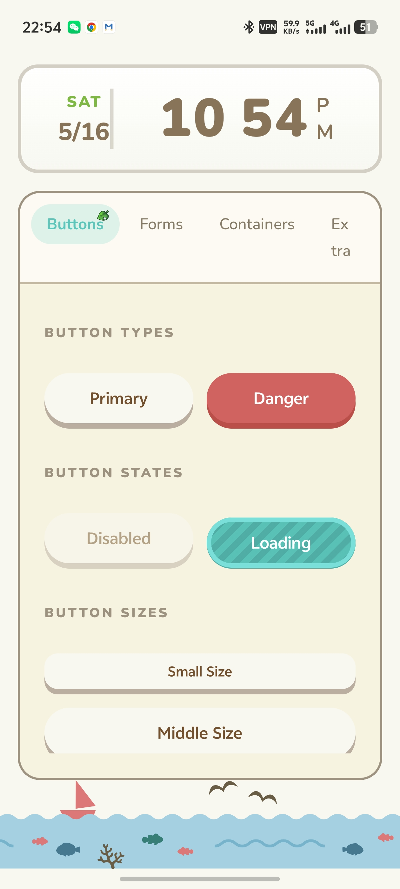
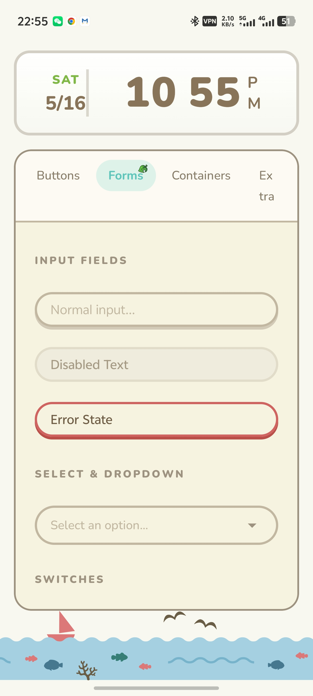
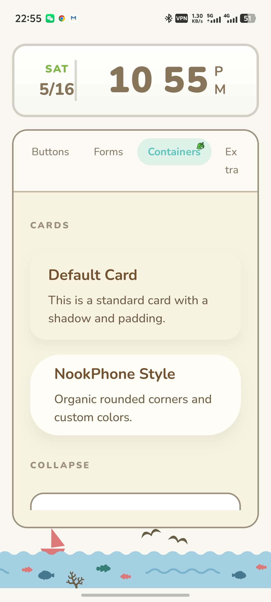
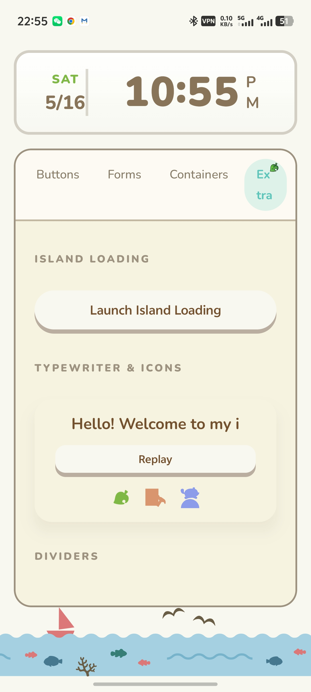

# 🏝 Animal-Island-UI

        

一款参考《动物森友会》风格的 Android 组件库

 

    
    
    

 

    

 

    简体中文 | <a href="./docs/README.en.md">English</a>

## 介绍

本项目是基于 Jetpack Compact 实现的轻量 UI 组件库，设计风格灵感来源于任天堂《集合啦！动物森友会》游戏界面，用于个人前端技术练习与组件化开发学习。

所有视觉元素、布局、图标、动画均为独立设计实现，未直接使用任何任天堂官方美术素材、代码或资源文件。

## 预览

## 文档
面向不同场景的完整参考：

| 文档 | 用途 |
|---|---|
| [`AI_USAGE.md`](./AI_USAGE.md) | 面向 AI 代码助手的使用手册，逐字收录全部组件 props、类型与默认值，附 19 条硬性规则与可复制样板，杜绝臆造 API。 |
| [`DESIGN_PROMPT.md`](./DESIGN_PROMPT.md) | 一键复刻提示词，适配 v0 / Figma AI / Midjourney / DALL-E，含色板、字体、尺寸表、Modal clip-path 与禁用清单。 |
| [`skill/SKILL.md`](./skill/SKILL.md) | 像素级样式规范 Skill，覆盖设计 token、全部组件精确 CSS、Demo 布局数值、CSS 变量模板与新组件开发 Checklist。 |
| [`CONTRIBUTING.md`](./CONTRIBUTING.md) | 贡献指南 |

## 注意事项

- 本项目仅用于个人学习、研究与非商业展示，禁止任何形式的商业使用、二次售卖或盈利行为。
- 不用于任何商业产品、企业项目、对外服务或付费模板。
- 使用本组件库产生的任何风险由使用者自行承担。

## 版权与免责声明

- 本项目并非任天堂官方产品，与任天堂株式会社无任何关联、授权或合作关系。
- 项目名称中包含的游戏名称仅为风格描述性引用，不构成商标使用或品牌关联。
- 所有界面风格仅为设计灵感参考，不构成对原作品的复制或侵权。
- 若版权方认为相关内容存在侵权嫌疑，可通过邮箱联系，本人将在第一时间进行整改或删除处理。

## 联系方式

如有问题或版权相关沟通，请通过 Issue 或邮件联系。

## License

MIT
本项目基于 MIT 开源协议发布，仅限学习使用，作者不对因使用本库导致的任何法律问题或损失承担责任。
